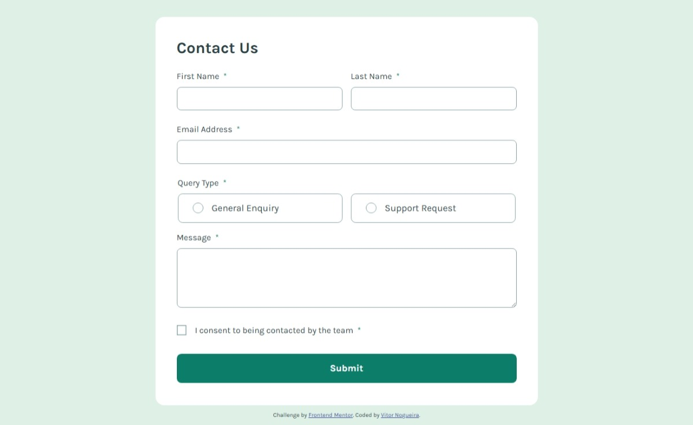

# Frontend Mentor - Contact form solution

This is a solution to the [Contact form challenge on Frontend Mentor](https://www.frontendmentor.io/challenges/contact-form--G-hYlqKJj). Frontend Mentor challenges help you improve your coding skills by building realistic projects. 

## Table of contents

- [Overview](#overview)
  - [The challenge](#the-challenge)
  - [Screenshot](#screenshot)
  - [Links](#links)
- [My process](#my-process)
  - [Built with](#built-with)
  - [What I learned](#what-i-learned)
  - [AI Collaboration](#ai-collaboration)
- [Author](#author)

## Overview

### The challenge

Users should be able to:

- Complete the form and see a success toast message upon successful submission
- Receive form validation messages if:
  - A required field has been missed
  - The email address is not formatted correctly
- Complete the form only using their keyboard
- Have inputs, error messages, and the success message announced on their screen reader
- View the optimal layout for the interface depending on their device's screen size
- See hover and focus states for all interactive elements on the page

### Screenshot



### Links

- Solution URL: [https://github.com/VitorEmanoelNogueira/contact-form-main](https://github.com/VitorEmanoelNogueira/contact-form-main)
- Live Site URL: [https://vitoremanoelnogueira.github.io/contact-form-main/](https://vitoremanoelnogueira.github.io/contact-form-main/)

## My process

### Built with

- Semantic HTML5 markup
- CSS custom properties
- Flexbox
- CSS Grid
- Mobile-first workflow

### What I learned

- How to create and manipulate toast messages;
- How to handle fully custom buttons;
- How to handle the forced-colors mode better;
- How to handle the chromium autofill triggering errors in other inputs with document.ActiveElement;
```js
if ("touched" in field) {
    // Ignore synthetic focus events triggered by Chromium autofill.
    // Only mark the field as touched when it actually becomes the active element.
    field.input.addEventListener("focus", () => {
        if (document.activeElement !== field.input) return;
            
        field.touched = true;
        });
    }
```
- How screen readers work when announcing fields `role="status"` and how changing the field from `display:none` to `display:block or flex` is not guaranteed to work in it.

### AI Collaboration

- I used ChatGPT to help me think, structure and debug. It worked specially well when investigating the problem with chromium autofill to stop the trigger of errors in fields that weren't filled.

## Author

- Frontend Mentor - [@VitorEmanoelNogueira](https://www.frontendmentor.io/profile/VitorEmanoelNogueira)